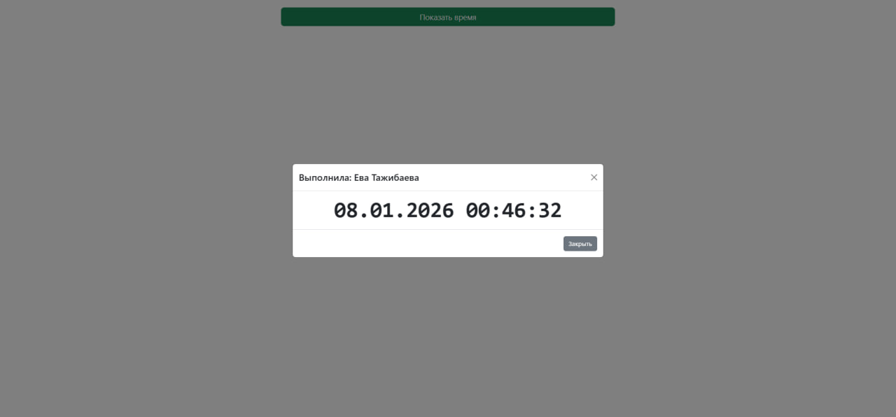

# Отчёт (Vite + Bootstrap + Luxon)

## Ссылки

- Репозиторий: https://github.com/0Tzhbeva0/vite-bootstrap-luxon
- Опубликованная страница: https://0tzhbeva0.github.io/vite-bootstrap-luxon/

## UI

## Команды

- Dev: `npm run dev`
- Build: `npm run build`
- Preview: `npm run preview`

## Размер бандла (после `npm run build`)

Файлы в `dist/assets`:

- JS: `index-DiVe5ve4.js` — 93 809 bytes (gzip: 29.83 kB)
- CSS: `index-C8jHtbCj.css` — 41 718 bytes (gzip: 7.96 kB)
- Итого: 135 527 bytes

